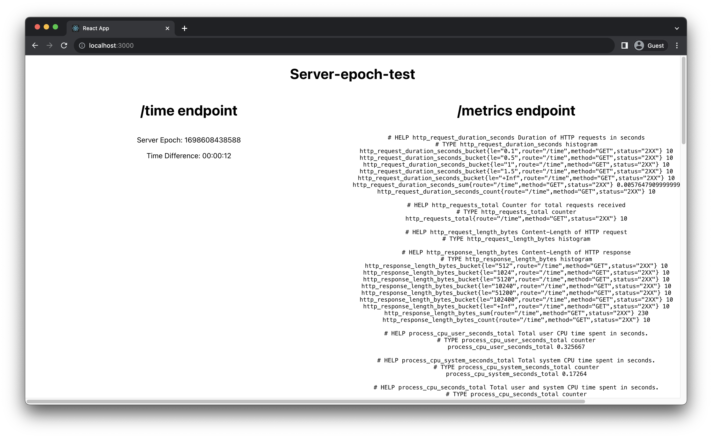

# server-epoch-test

A technical test to create a simple server and client with ExpressJS and ReactJS.

<p align="center">
    
</p>

## Run the Epoch-service

Navigate to the server folder

```bash
cd epoch-service
npm install
npm run start
```

Navigate to [http://localhost:3001/](http://localhost:3001/)

### Run tests

```bash
npm test
```

## Run the Client application

Navigate to the server folder

```bash
cd client
npm install
npm run start
```

Navigate to [http://localhost:3000/](http://localhost:3000/)

### Run tests

```bash
npm test
```

---

This project uses ESLint to identify and report on patterns

```bash
npx eslint yourfile.js
```

## If I had more time

If I had more time I would have liked to explore more about the ExpressJS framework and identify any best practices I may have violated with regards to running the application in production, structuring of the files, improved API error handling.

While I used TDD in most places, if I had more time I would consider writing more thorough unit tests for the ReactJS client application.

I would have liked to apply a standardised TSLint and ESLint across both the service and client applications, rather than 1 per application.

I would have written the epoch-service with Typescript rather than JavaScript to ensure type safety.
